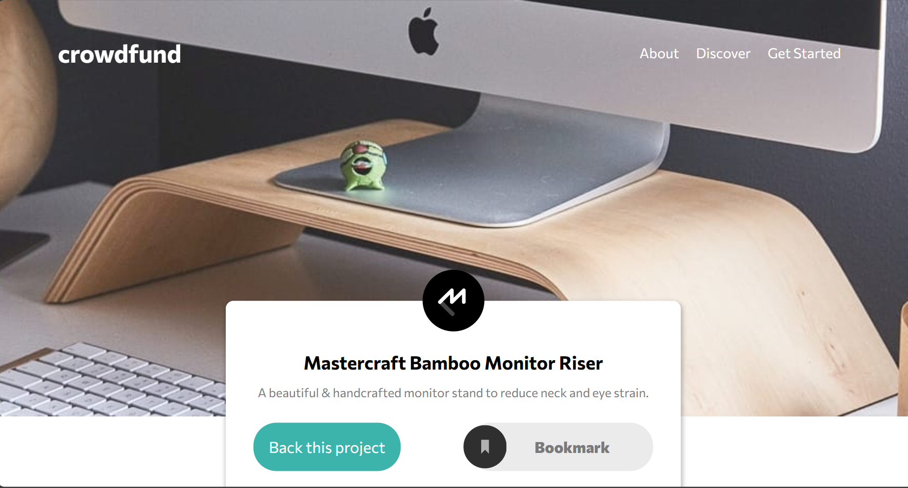

#  Crowdfund - Landing Page

I love doing this kind of challenges, this one is from:
- (https://www.frontendmentor.io/challenges)

I used vanilla JS to validate each form and CSS to make the modals and styles
